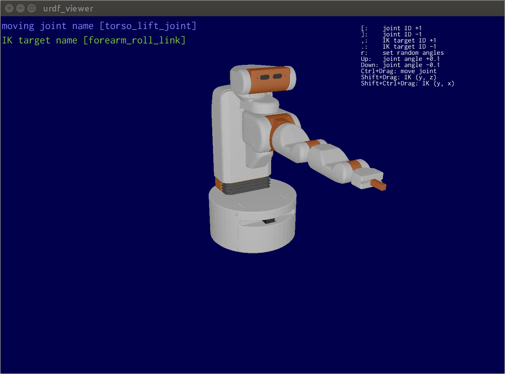
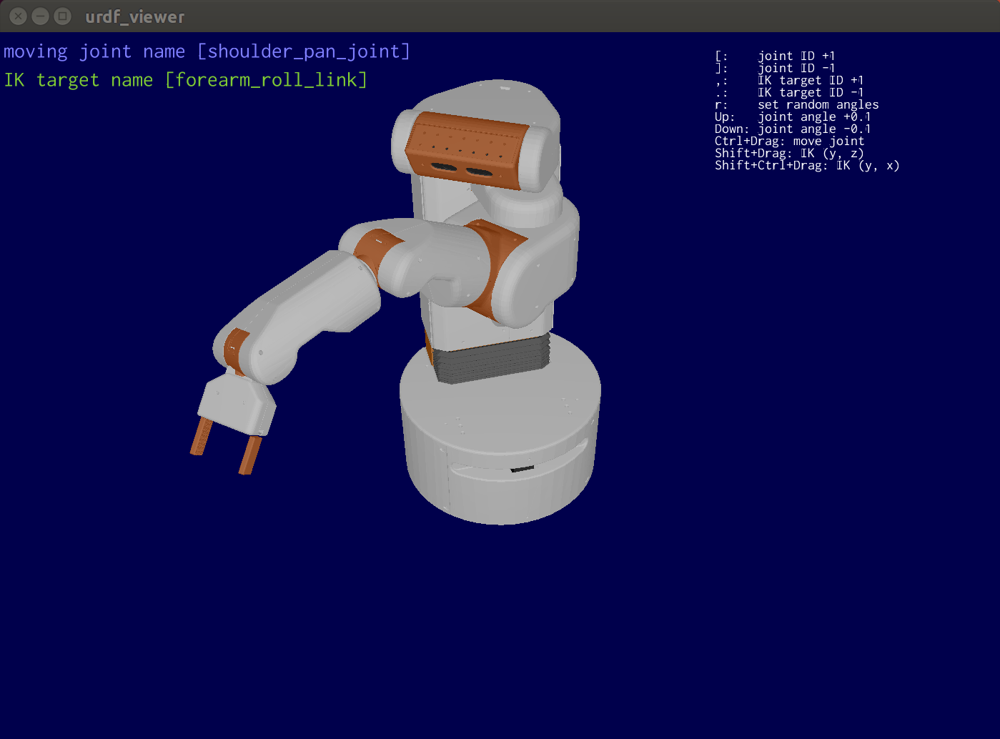
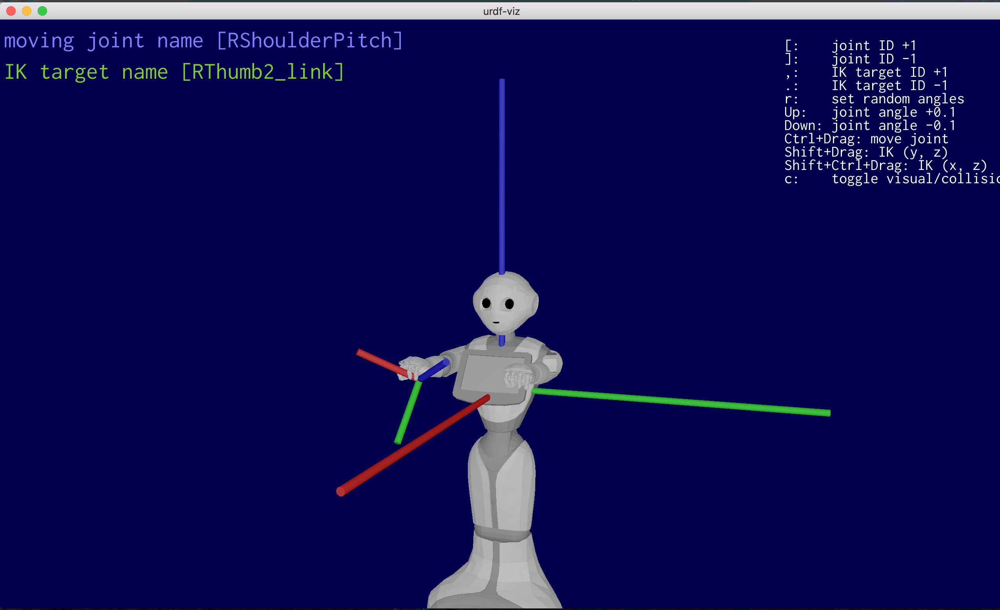
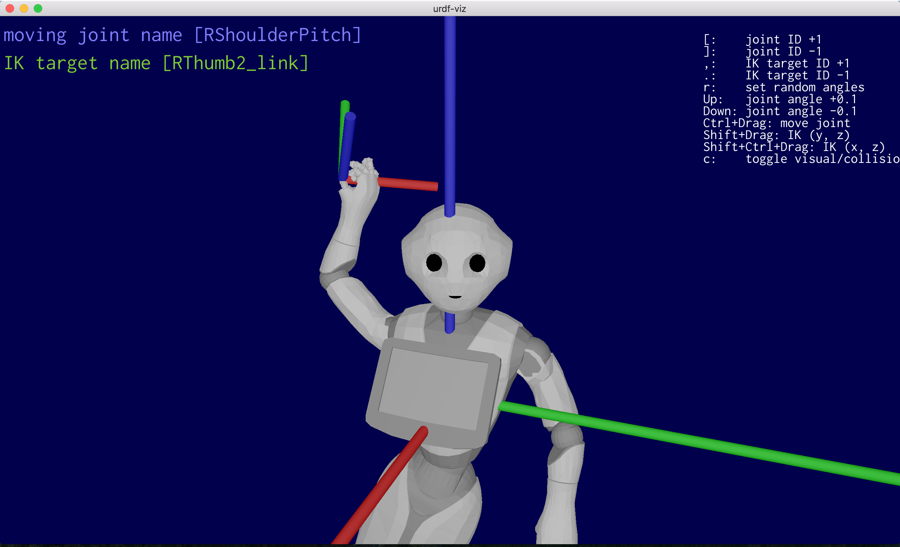
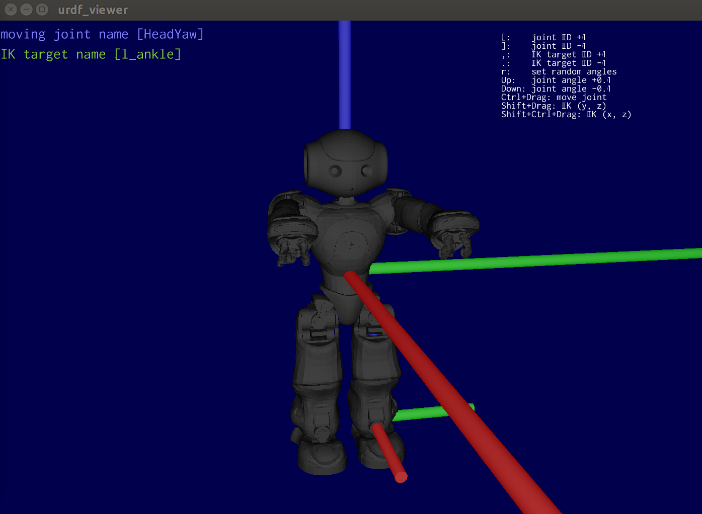
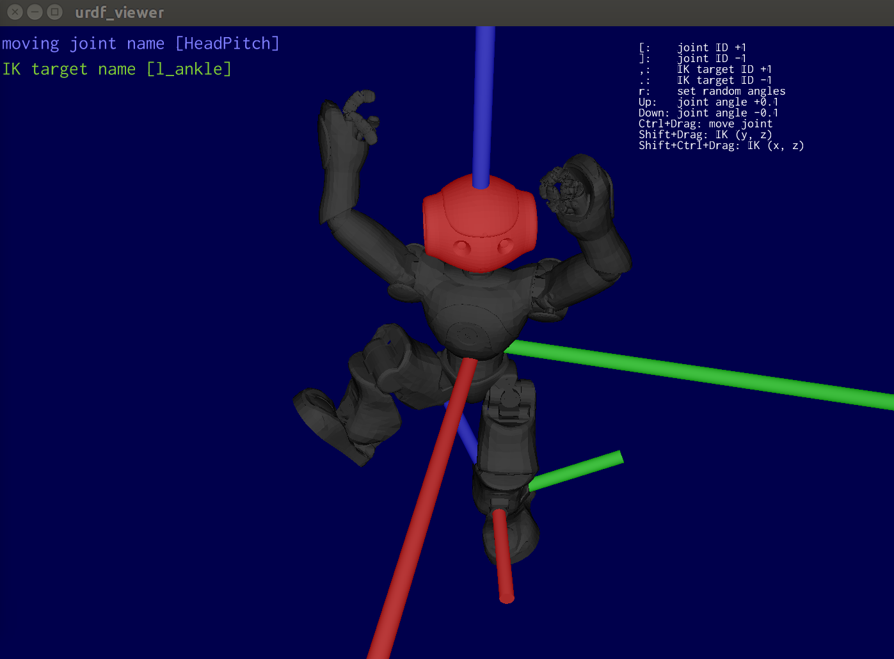
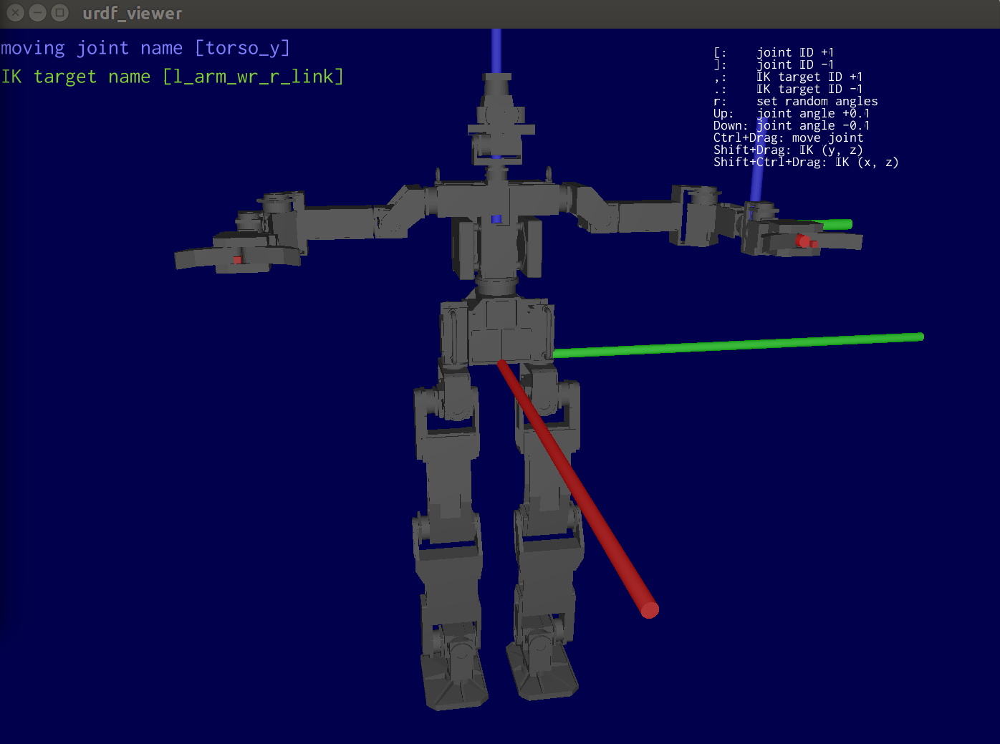
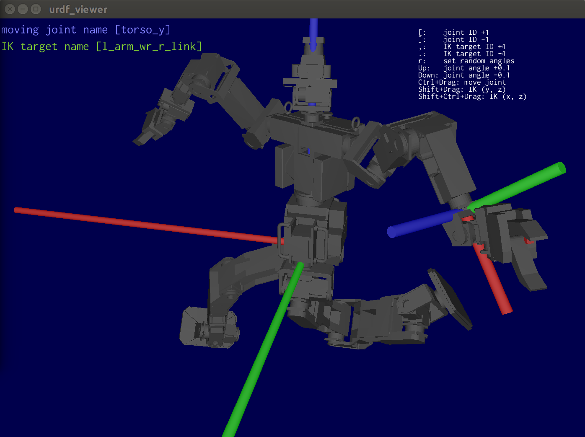
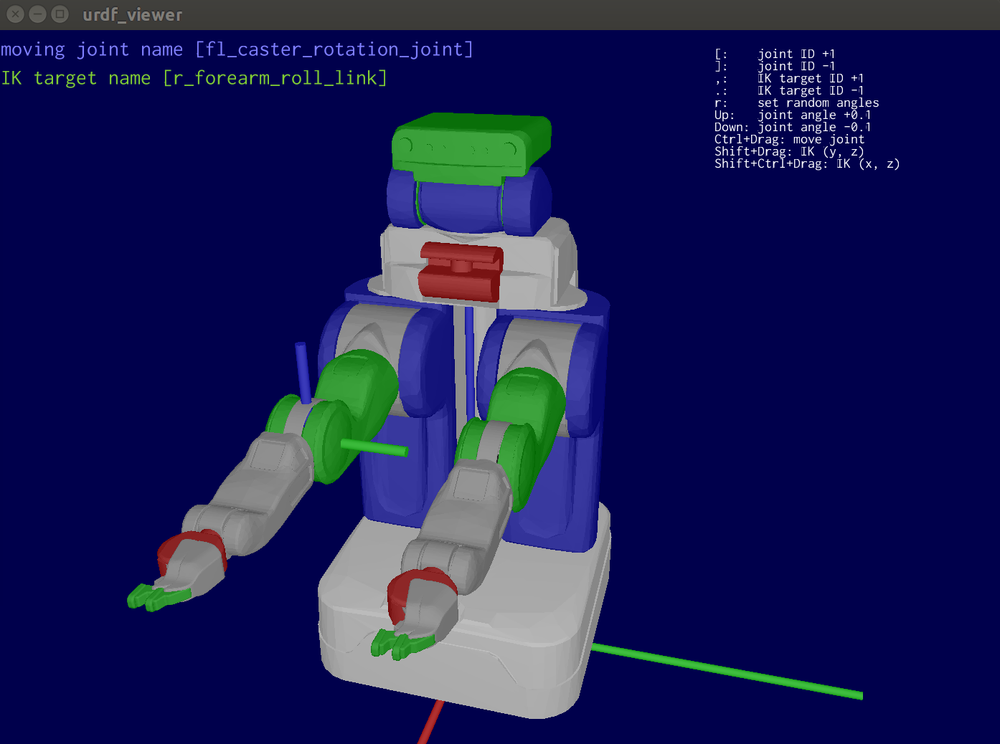
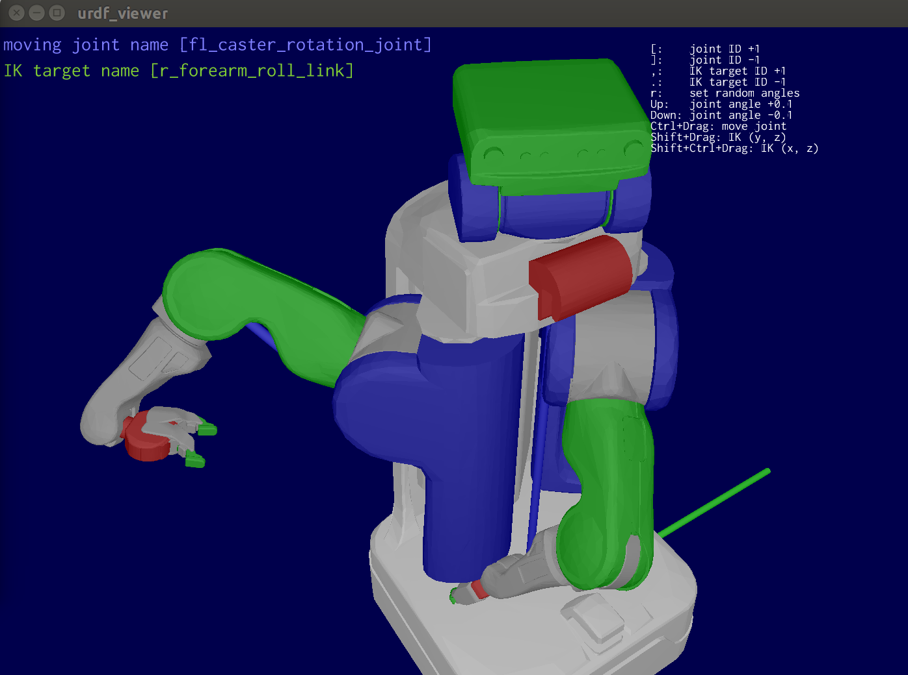

urdf_viz
==================

Visualize [URDF(Unified Robot Description Format)](http://wiki.ros.org/urdf) file.
`urdf_viz` is written by rust-lang.
It supports `.obj` files as mesh format, but it can convert other files using `meshlabserver` command
or `assimp` command. Please install `meshlab` and `assimp`.

Install
--------------

```bash
$ cargo install urdf_viz
```

Install mesh converter commands

```bash
$ sudo apt-get install meshlab assimp-utils
```

Command line
--------------

`urdf_viewer` command will be installed by cargo.

```bash
$ urdf_viewer URDF_FILE.urdf
```

It is possible to use xacro file directly.
It will be converted by `rosrun xacro xacro` in `urdf_viewer`.

```bash
$ urdf_viewer XACRO_FILE.urdf.xacro
```

The default mesh converter is `meshlabserver`. If you failed to convert mesh files,
try `-a` option to use `assimp`.

```bash
$ urdf_viewer -a URDF_FILE.urdf
```

For other commands, please read `-h` option.

```bash
$ urdf_viewer -h
```

GUI
--------------
In the GUI, you can

* Move a joint
  * set the angle of a joint by `Up`/`Down` key
  * `Ctrl` + Drag to move the angle of a joint
  * change the joint to be moved by `[` and `]`
* Inverse kinematics (only positions)
  * `Shift` + Drag to use inverse kinematics(Y and Z axis)
  * `Shift` + `Ctrl` + Drag to use inverse kinematics(Y and X axis)
  * change the move target for inverse kinematics by `,` and `.`
* `r` key to set random joints
* move camera
  * Mouse Right Drag to translate camera position
  * Mouse Left Drag to look around
  * Scroll to zoom in/out

Garally
--------------------











