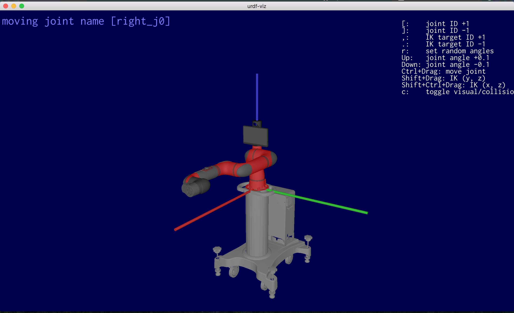
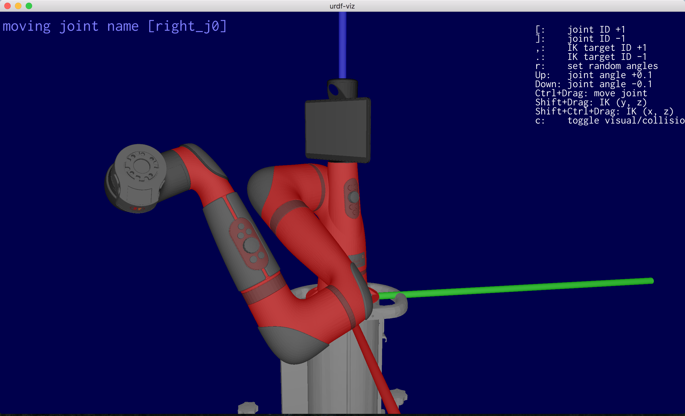
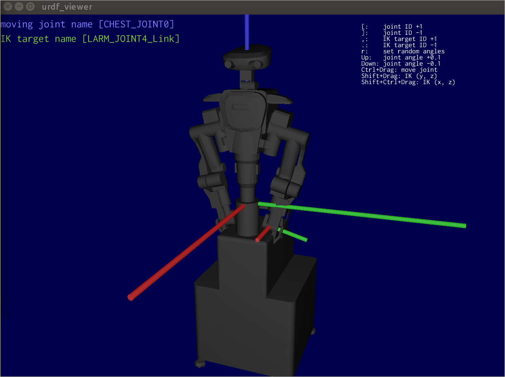
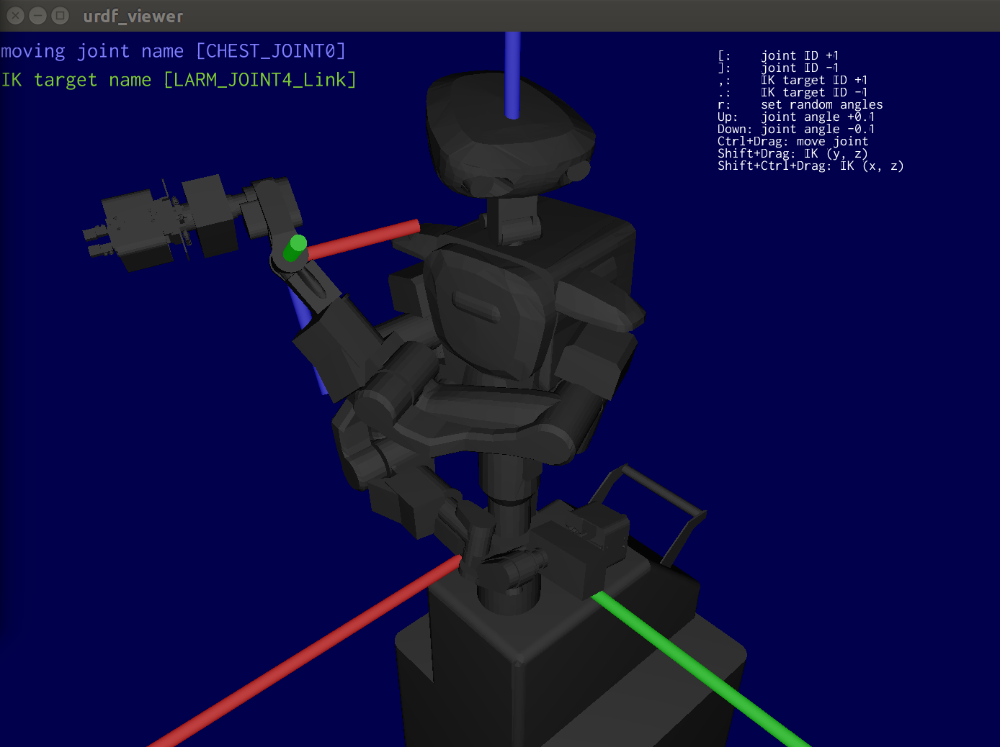
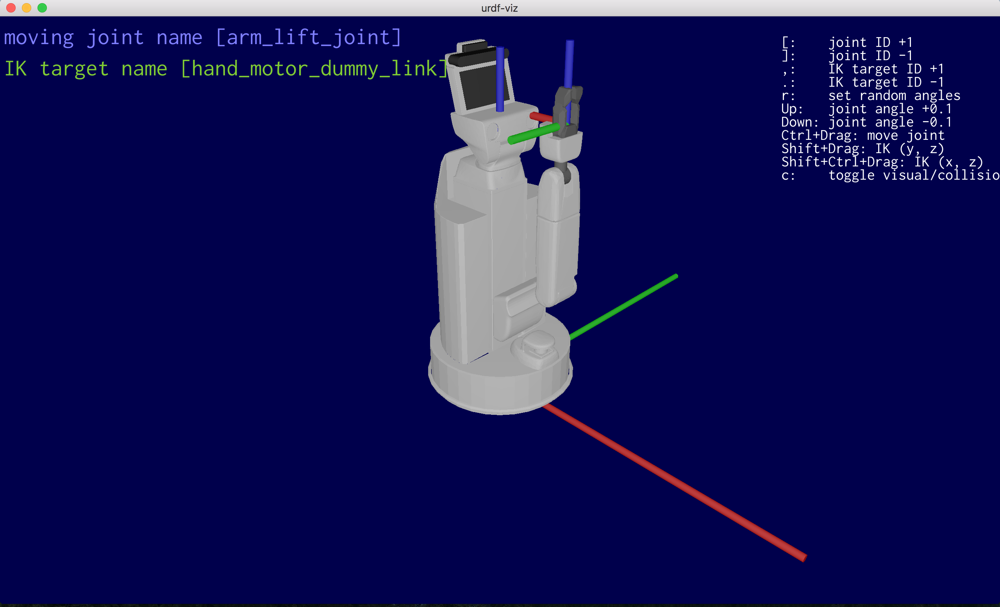
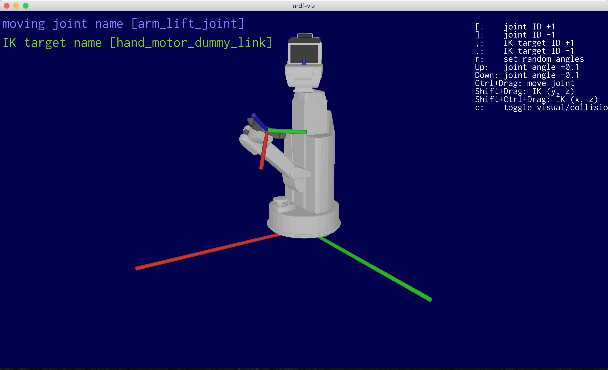

# urdf-viz

[](https://github.com/openrr/urdf-viz/actions) [](https://crates.io/crates/urdf-viz) [](https://docs.rs/urdf-viz) [](https://discord.gg/8DAFFKc88B)

Visualize [URDF(Unified Robot Description Format)](http://wiki.ros.org/urdf) file.
`urdf-viz` is written in Rust-lang.

## Install

### Install with `cargo`

If you are using rust-lang already and `cargo` is installed, you can install by `cargo install`.

```bash
cargo install urdf-viz
```

If you want to use mesh other than `.obj`, `.stl`, and `.dae` files, you need to install
with assimp like below.

```bash
cargo install urdf-viz --features assimp
```

### Pre-requirements for build

#### Common

If you want to use `--features assimp` to use mesh other than `.obj`, `.stl`, and `.dae` files, you need [cmake](https://cmake.org/download/).

#### On Linux

If you have not installed ROS, you may need `cmake`, `xorg-dev`, `glu` to
compile `assimp-sys` and `glfw-sys`.

```bash
sudo apt-get install cmake xorg-dev libglu1-mesa-dev
```

### Download binary

You can download prebuilt binaries from the [release page](https://github.com/openrr/urdf-viz/releases).
Prebuilt binaries are available for macOS, Linux, and Windows (static executable).

### Install via Homebrew

You can install urdf-viz using [Homebrew tap on macOS and Linux](https://github.com/openrr/homebrew-tap/blob/main/Formula/urdf-viz.rb):

```sh
brew install openrr/tap/urdf-viz
```

## How to use

`urdf-viz` command will be installed.
It needs `rosrun` and `rospack` to resolve `package://` in `<mesh>` tag, and
it uses `xacro` to convert `.xacro` file into urdf file.
It means you need `$ source ~/catkin_ws/devel/setup.bash` or something before using `urdf-viz`.

```bash
urdf-viz URDF_FILE.urdf
```

It is possible to use xacro file directly.
It will be converted by `rosrun xacro xacro` inside of `urdf-viz`.

```bash
urdf-viz XACRO_FILE.urdf.xacro
```

If your xacro file has some arguments, you can pass them by `--xacro-args` option.

```bash
urdf-viz XACRO_FILE.urdf.xacro --xacro-args arg1=value arg2=value
```

For other options, please read the output of `-h` option.

```bash
urdf-viz -h
```

If there are no "package://" in mesh tag, and don't use xacro you can skip install of ROS.

If there are "package://" in mesh tag, but path or URL to package is known and
don't use xacro you can also skip install of ROS [by replacing package with path
or URL](https://github.com/openrr/urdf-viz/pull/176).

## GUI Usage

In the GUI, you can do some operations with keyboard and mouse.

* `l` key to reload the urdf from file
* `c` key to toggle collision model or visual mode
* Move a joint
  * set the angle of a joint by `Up`/`Down` key
  * `Ctrl` + Drag to move the angle of a joint
  * change the joint to be moved by `o` (`[`) and `p` (`]`)
* Inverse kinematics (only positions)
  * `Shift` + Drag to use inverse kinematics(Y and Z axis)
  * `Shift` + `Ctrl` + Drag to use inverse kinematics(X and Z axis)
  * change the move target for inverse kinematics by `,` or `.`
* `r` key to set random joints
* `z` key to reset joint positions and origin
* Move view point
  * Mouse Right Drag to translate view camera position
  * Mouse Left Drag to look around
  * Scroll to zoom in/out

## Web I/O interface

You can set/get the joint angles using http/JSON.
Default port number is 7777. You can change it by `-p` option.
(`jq` is used for JSON formatter in the following examples)

### Set joint angles

POST the JSON data, which format is like below. You have to specify the names of joints and positions (angles).
The length of `names` and `positions` have to be the same. You don't need write
all joint names, it means you can specify a part of the joints.

```json
{
  "names": ["joint_name1", "joint_name2"],
  "positions": [0.5, -0.1]
}
```

You can try it using `curl`.

```bash
$ curl -H "Accept: application/json" -H "Content-type: application/json" -X POST -d '{"names": ["r_shoulder_yaw", "r_shoulder_pitch"], "positions": [0.8, -0.8]}' http://127.0.0.1:7777/set_joint_positions | jq
{
  "is_ok": true,
  "reason": ""
}
```

### Get joint angles as JSON

The result JSON format of getting the joint angles is the same as the *Set* method.

```bash
$ curl http://127.0.0.1:7777/get_joint_positions | jq
{
  "names": [
    "r_shoulder_yaw",
    "r_shoulder_pitch",
    "r_shoulder_roll",
    "r_elbow_pitch",
    "r_wrist_yaw",
    "r_wrist_pitch",
    "l_shoulder_yaw",
    "l_shoulder_pitch",
    "l_shoulder_roll",
    "l_elbow_pitch",
    "l_wrist_yaw",
    "l_wrist_pitch"
  ],
  "positions": [
    0.8,
    -0.8,
    -1.3447506,
    -1.6683152,
    -1.786362,
    -1.0689334,
    0.11638665,
    -0.5987091,
    0.7868867,
    -0.027412653,
    0.019940138,
    -0.6975361
  ]
}
```

### Set Robot Origin

```bash
$ curl -H "Accept: application/json" -H "Content-type: application/json" -X POST -d '{"position":[0.2,0.0,0.0],"quaternion":[0.0,0.0,0.0,1.0]}' http://127.0.0.1:7777/set_robot_origin
{"is_ok":true,"reason":""}
```

The order of the quaternion elements is `w, i, j, k`.

### Get Robot Origin

```bash
$ curl http://127.0.0.1:7777/get_robot_origin
{"position":[0.2,0.0,0.0],"quaternion":[1.0,0.0,0.0,0.0]}
```

### Get URDF Text

```bash
curl http://127.0.0.1:7777/get_urdf_text
```

## Gallery











## Dependencies

* [kiss3d](https://github.com/sebcrozet/kiss3d): `urdf-viz` is strongly depend on `kiss3d`, which is super easy to use, great 3D graphic engine.
* [nalgebra](https://github.com/sebcrozet/nalgebra): linear algebra library.
* [k](https://github.com/openrr/k): kinematics library which is based on [nalgebra](https://github.com/sebcrozet/nalgebra). It can load URDF files using `urdf-rs`.
* [mesh-loader](https://github.com/openrr/mesh-loader): Mesh files (`.obj`, `.stl`, and `.dae`) loader.
* [urdf-rs](https://github.com/openrr/urdf-rs): URDF file loader.
* [structopt](https://github.com/TeXitoi/structopt): super easy command line arguments parser.

## `OpenRR` Community

[Here](https://discord.gg/8DAFFKc88B) is a discord server for `OpenRR` users and developers.
